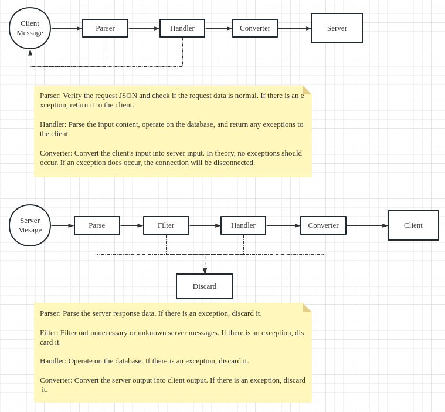

### Features

这个项目是一个用Golang编写的WebSocket代理服务，具有以下功能：

1.客户端数据代理：建立自己的WebSocket服务，并将客户端请求的数据通过该服务进行处理。

2.与目标WebSocket连接代理：代理服务在同时建立与目标WebSocket的连接时，将客户端经过处理的最终消息发送到目标WebSocket服务。

3.服务端数据代理：服务端响应的数据依次经过解析器、过滤器、处理器、转换器进行处理，并最终响应给客户端。

此外，代理服务的客户端和服务端的过滤器、解析器、处理器、转换器均以接口方式实现，在初始化时需要传入实现该接口的结构体。需要注意的是，客户端和服务端的过滤器、解析器、处理器、转换器不相同，需要分开配置，同时支持代理的目标地址动态配置，可以第一次建立客户端连接时根据请求参数组织。


This project is a WebSocket proxy service written in Golang that has the following features:

1.Client data proxy: Establishes its own WebSocket service and processes client request data through this service.

2.Proxy to target WebSocket connection: When the proxy service simultaneously establishes a connection with the target WebSocket, it sends the finally processed message received from the client to the target WebSocket service.

3.Server data proxy: The response data from the server is sequentially processed through parsers, filters, handlers, and converters, and finally responded to the client.

Furthermore, the client-side and server-side filters, parsers, handlers, and converters of the proxy service are implemented as interfaces, and a structure implementing these interfaces needs to be passed in during initialization. It should be noted that the client-side and server-side filters, parsers, handlers, and converters are different and need to be configured separately. Additionally, the proxy supports dynamically configuring the target address, which can be organized based on the request parameters when establishing the client connection for the first time.





```golang

// Initialize proxy server
server := ProxyServer{
    ClientHandler: &clientHandle{},       // Set client handler
    ServerHandler: &serverHandle{},       // Set server handler
    TargetUrl:     "ws://localhost:9090", // Set target URL
}

// Proxy websocket service
http.HandleFunc("/ws/proxy", func(w http.ResponseWriter, r *http.Request) {
    if err := server.Proxy(w, r, func(s *ProxyServer) {
        // Dynamic configuration of target address
        s.TargetUrl = s.TargetUrl + "/?id=123456"
    }); err != nil {
        log.Fatal(err.Error())
    }
})

if err := http.ListenAndServe(":8080", nil); err != nil {
    panic(err)
}

```
